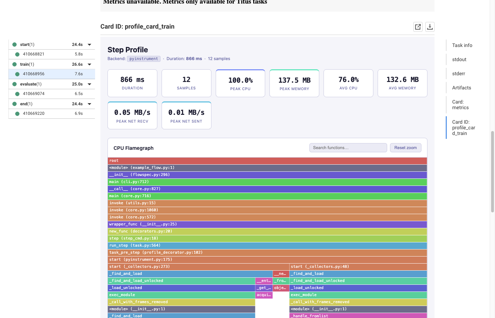
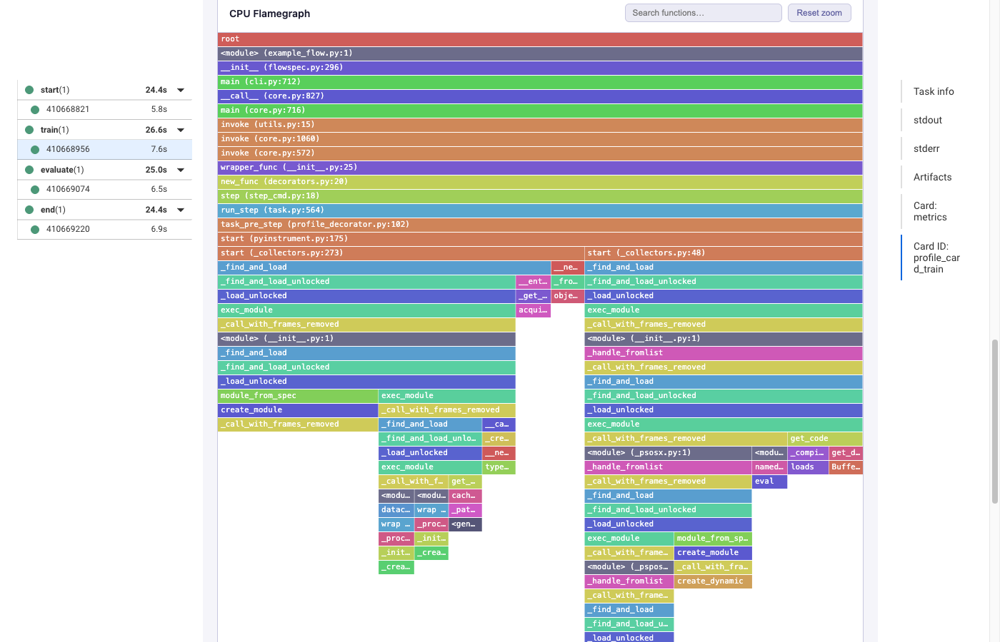
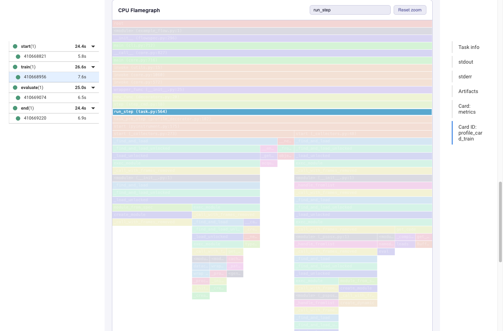
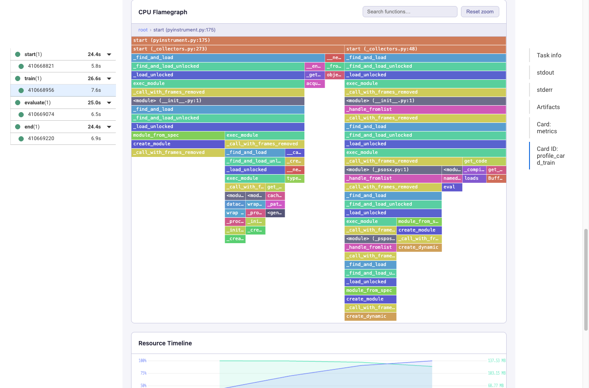
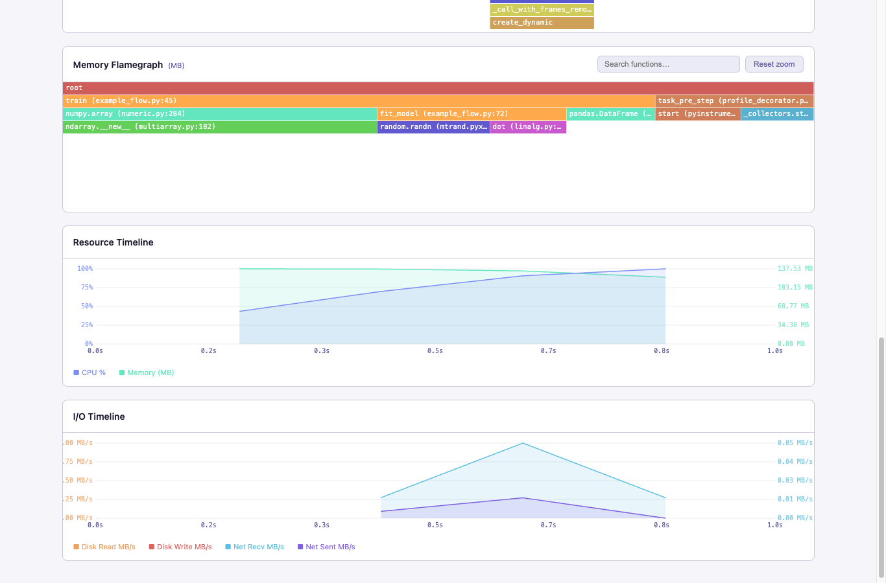
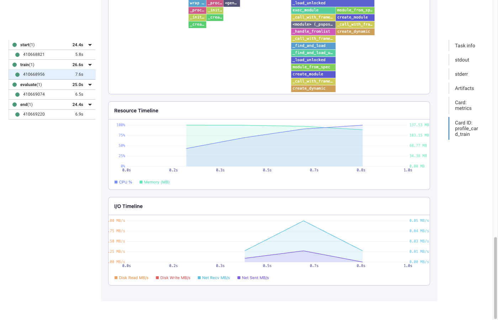
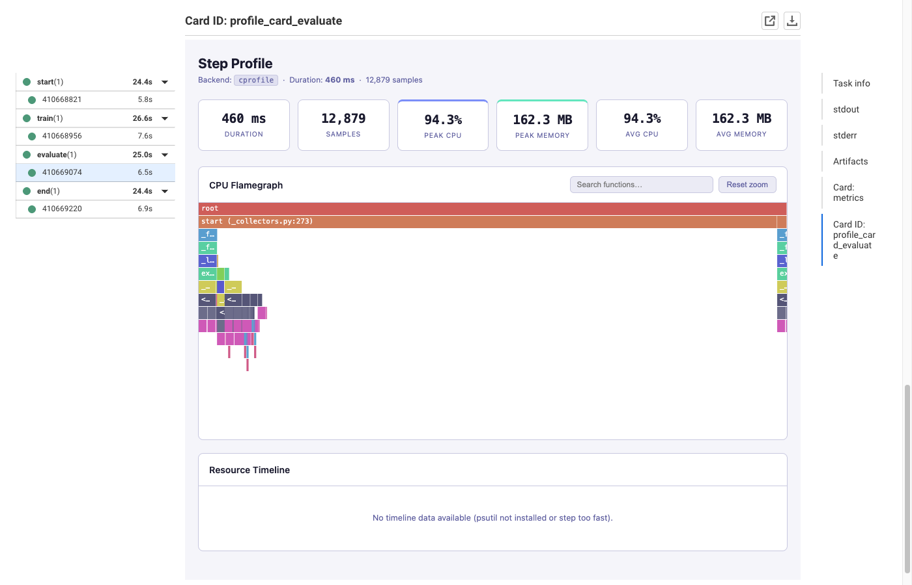

# metaflow-profiler

[](https://github.com/npow/metaflow-profiler/actions/workflows/ci.yml)
[](https://pypi.org/project/metaflow-profiler/)
[](https://pypi.org/project/metaflow-profiler/)
[](LICENSE) [](https://mintlify.com/npow/metaflow-profiler)

**Add one decorator to any Metaflow step and get an interactive flamegraph card in the UI.**

---

When a Metaflow step is slow or runs out of memory, finding the cause means adding profiling code, re-running locally, deciphering `cProfile` tables, and correlating a separate `top` session — all before you can start actually fixing anything.

`@profile_card` wraps any step with a single decorator. It captures the CPU call tree, memory allocations, and system resource usage, then renders a self-contained interactive card directly in the Metaflow UI — visible even when the step crashes.

## Quick start

```bash
pip install metaflow-profiler[pyinstrument]
```

```python
from metaflow import FlowSpec, step
from metaflow_extensions.profiler.plugins.profile_decorator import profile_card

class MyFlow(FlowSpec):

    @profile_card(profiler="pyinstrument")
    @step
    def train(self):
        # ... your heavy computation ...
        self.next(self.end)

    @step
    def end(self):
        pass

if __name__ == "__main__":
    MyFlow()
```

```bash
python flow.py run
python flow.py card view --id profile_card_train
```

## What you get

### Stats grid

Duration, sample count, peak/avg CPU, peak/avg memory — plus disk I/O, network, and GPU stats when present. Stat cards appear automatically and hide when zero.



### CPU Flamegraph

Every function call is a coloured block; width represents time spent.



**Search** highlights matching frames across the whole tree while dimming everything else — useful for tracking down a specific function across multiple call paths.



**Click to zoom** into any frame. A breadcrumb trail lets you navigate back up the call stack.



### Memory Flamegraph

When [memray](https://github.com/bloomberg/memray) is installed (`pip install metaflow-profiler[memray]`), a second flamegraph shows which functions allocated the most memory at peak RSS, in MB.



### Resource Timeline + I/O Timeline

Dual-axis time-series charts polled every 500 ms throughout the step.

- **Resource Timeline** — CPU % (left axis) and RSS memory in MB (right axis)
- **I/O Timeline** — Disk read/write MB/s (left axis) and network recv/sent MB/s (right axis)

Both charts share the same time axis so you can correlate spikes across metrics.



### cProfile backend

The `cprofile` backend uses Python's built-in profiler — no extra dependencies. It captures every function call so sample counts are much higher. The flamegraph is otherwise identical.



### Failed steps

The card renders even when the step raises an exception — it shows the full profile up to the point of failure with a red banner at the top.

## Backends

| Backend | Install | Overhead | Notes |
|---------|---------|----------|-------|
| `pyinstrument` | `pip install metaflow-profiler[pyinstrument]` | ~1% | Statistical; recommended |
| `cprofile` | _(built-in)_ | Medium | Deterministic; captures every call |

## Optional extras

| Extra | Install | Adds |
|-------|---------|------|
| `memray` | `pip install metaflow-profiler[memray]` | Memory allocation flamegraph |
| `gpu` | `pip install metaflow-profiler[gpu]` | GPU utilisation % + GPU memory timeline |
| `all` | `pip install metaflow-profiler[all]` | Everything above |

## How it works

```
@profile_card decorator
    ↓  starts backend in task_pre_step, stops in task_post_step / task_exception
Card renderer (ProfileCard)
    ↓  reads artifact, renders self-contained HTML
Backend registry
    ↓  picks best available backend
Backend implementations (pyinstrument / cprofile)
    ↓  wraps _TimelineCollector (psutil) + _MemoryTracker (memray)
Abstract interface (ProfilerBackend / ProfileData)
```

No upward imports between layers — enforced by structural tests.

## Development

```bash
git clone https://github.com/npow/metaflow-profiler
cd metaflow-profiler
pip install -e ".[pyinstrument,dev]"

# Lint + type check
ruff check src/ tests/
mypy src/

# Tests
pytest tests/unit/
pytest tests/structural/ -m structural
```

## License

Apache 2.0 — see [LICENSE](LICENSE).
